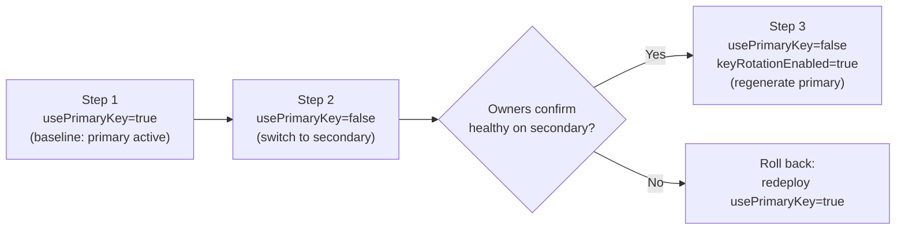

# 🔑 Access Contract Key Rotation Guide

This guide explains the **optional, zero-downtime subscription key rotation** capability of Citadel Access Contracts. It lets you rotate the APIM subscription key handed to a use case **without any service interruption**, across the primary gateway and every mirrored gateway, Key Vault, and Foundry connection.

> **Backward compatibility promise**: Key rotation is 100% opt-in. The new parameters default to `usePrimaryKey = true` and `keyRotationEnabled = false`, which reproduce the existing behavior exactly (primary key active, nothing regenerated). **If you do nothing, nothing changes.**

---

## 🧠 Core concept: two keys, one active

Every APIM subscription has **two keys** — a **primary** and a **secondary**. Both are always valid; a client can authenticate with either. The access contract treats one of them as the **active key** — the value that gets pushed to consumers (Key Vault secrets, Foundry connections, and any additional gateways).

| Parameter | Effect |
|-----------|--------|
| `usePrimaryKey = true` (default) | **Active = primary**, non-active = secondary |
| `usePrimaryKey = false` | **Active = secondary**, non-active = primary |

The other key — the **non-active** key — is the one that gets regenerated during rotation. Because consumers are only ever handed the *active* key, regenerating the *non-active* key never disrupts them.

### Can Bicep regenerate an APIM key?

ARM/Bicep has **no native "regenerate key" action** for APIM subscriptions. Instead, this package regenerates a key **declaratively**: it assigns a **fresh value** to the non-active key slot (`primaryKey` / `secondaryKey`) on the subscription resource. Assigning a new value invalidates the old one — functionally equivalent to a regenerate, with the added benefit that the exact same value can be mirrored to every additional gateway so keys stay in sync.

The fresh value is derived from `rotationKeySeed` (which defaults to `newGuid()`, so every rotation deployment produces a new key) or supplied verbatim via `rotationKeyOverride`.

---

## 🔩 Parameters

Add these to your use-case `.bicepparam` file as needed. All are optional.

| Parameter | Type | Default | Description |
|-----------|------|---------|-------------|
| `usePrimaryKey` | bool | `true` | Which key is **active** (handed to consumers). `true` = primary, `false` = secondary. |
| `keyRotationEnabled` | bool | `false` | When `true`, regenerate (overwrite) the **non-active** key, invalidating its old value. |
| `rotationKeySeed` | string | `newGuid()` | Seed used to derive a fresh 64-char rotation key. New value every deployment. Ignored if `rotationKeyOverride` is set. |
| `rotationKeyOverride` | secure string | `''` | Explicit rotation key value for deterministic re-runs. Empty = derive from `rotationKeySeed`. |

> Which key gets regenerated is determined by `usePrimaryKey`: with `usePrimaryKey = false`, the **primary** is the non-active key and therefore the one rotated; with `usePrimaryKey = true`, the **secondary** is rotated.

---

## 🚦 The 3-step zero-downtime rotation

The whole point of rotating in **three deliberate steps** is that **the active key never changes underneath a running consumer**. You switch consumers onto the standby key first, confirm they are healthy, and only then invalidate the old key.

The example below rotates the **primary** key (the currently active one). To rotate the secondary, simply mirror the steps (see [Rotating the secondary key](#-rotating-the-secondary-key)).



### Step 1 — Baseline (primary active)

This is the normal deployed state of the contract. The **primary** key is active and stored in Key Vault / Foundry; both keys are valid.

```bicep
param usePrimaryKey = true
param keyRotationEnabled = false
```

### Step 2 — Switch consumers to the secondary key (no downtime)

Redeploy with `usePrimaryKey = false`. This **pushes the secondary key** to every target — Key Vault secrets, Foundry connections, and all additional gateways — while the **primary key is still fully valid**.

```bicep
param usePrimaryKey = false
param keyRotationEnabled = false
```

Result:
- All in-contract services are now updated to the **secondary** key.
- The **primary** key still works, so any consumer that hasn't picked up the new secret yet keeps running. **No downtime.**

➡️ **Wait here.** Have the use-case owners confirm their applications have picked up the secondary key and are healthy (they may cache the old secret, or need a restart / secret-refresh cycle). This confirmation gate is what makes the rotation safe.

### Step 3 — Regenerate the (now non-active) primary key

Once owners confirm everyone is on the secondary key, redeploy **again** with `usePrimaryKey = false` **and** `keyRotationEnabled = true`. This **regenerates the primary** key (the non-active one), invalidating its old value.

```bicep
param usePrimaryKey = false
param keyRotationEnabled = true
```

Result:
- The old primary key is **now invalid**.
- Only the (active) secondary key works — rotation is complete, still with **no downtime**.

> After Step 3 you can leave the contract on the secondary key indefinitely, or run the reverse sequence later to rotate back to the primary.

---

## 🔁 Rotating the secondary key

To rotate the **secondary** key instead, keep the primary as the active key throughout:

| Step | Parameters | Effect |
|------|-----------|--------|
| 1. Baseline | `usePrimaryKey = true`, `keyRotationEnabled = false` | Primary active (normal state) |
| 2. Confirm consumers on primary | `usePrimaryKey = true`, `keyRotationEnabled = false` | Ensure everyone uses the primary key |
| 3. Regenerate secondary | `usePrimaryKey = true`, `keyRotationEnabled = true` | Non-active (secondary) key regenerated |

Because the secondary is already the non-active key when `usePrimaryKey = true`, rotating it is a single-step regeneration once you've confirmed consumers are on the primary.

---

## 🌐 Multi-gateway behavior (resiliency contracts)

When your contract mirrors across [additional APIM gateways](./access-contract-resiliency-guide.md), the primary gateway **owns both keys** and both the primary and secondary keys are **synced verbatim to every additional gateway**. This is essential: if only the primary key were synced, switching to the secondary (Step 2) would break requests hitting the additional gateways.

- The primary gateway generates and, when rotating, regenerates the keys.
- Additional gateways receive **both** keys explicitly (`explicitPrimaryKey` + `explicitSecondaryKey`), so a client uses the **same active key** regardless of which gateway serves the request — including after rotation.
- Deployment order is unchanged: primary first, additional gateways next (reusing the keys), then additional Key Vaults / Foundry connections.

---

## ✅ Verification

After each step, verify the deployment outputs and the live keys:

```powershell
# Deployment outputs report which key is active and whether rotation ran
az deployment sub show --name <deployment-name> --query properties.outputs.activeKeySlot.value
az deployment sub show --name <deployment-name> --query properties.outputs.keyRotationApplied.value

# Compare the live APIM subscription keys (primary + secondary)
az apim subscription show `
  --resource-group <apim-rg> --service-name <apim-name> `
  --subscription-id <serviceCode>-<BU>-<UseCase>-<ENV>-SUB-01 `
  --query "{primary: primaryKey, secondary: secondaryKey}" -o json

# Confirm the Key Vault secret now holds the ACTIVE key
az keyvault secret show --vault-name <kv-name> --name <api-key-secret-name> --query value -o tsv
```

Expected results per step:

| Step | `activeKeySlot` | Active key value | Non-active key value |
|------|-----------------|------------------|----------------------|
| 1 (baseline) | `primary` | primary (unchanged) | secondary (unchanged) |
| 2 (switch) | `secondary` | secondary (unchanged) | primary (**still valid**) |
| 3 (rotate) | `secondary` | secondary (unchanged) | primary (**changed / old value invalid**) |

For multi-gateway contracts, run the `az apim subscription show` check against **each** gateway and confirm the primary/secondary key values are identical everywhere.

---

## ⚠️ Notes & troubleshooting

- **Idempotency of Step 3**: with `keyRotationEnabled = true` and the default `rotationKeySeed = newGuid()`, **every** redeploy regenerates the non-active key again (a new value each run). This is intended — Step 3 is a deliberate, one-time action. To make re-runs deterministic (same value), set `rotationKeyOverride` to an explicit value.
- **Return to a "both keys valid" state**: after completing rotation, do a maintenance deploy with `keyRotationEnabled = false` so subsequent deployments don't keep regenerating the non-active key.
- **Rollback during Step 2**: if owners report problems on the secondary key before Step 3, simply redeploy with `usePrimaryKey = true` (rotation disabled). Since the primary was never invalidated, consumers fall back instantly.
- **Consumer secret caching**: applications that cache the api-key must refresh it (restart, Key Vault reference refresh, or managed cache TTL) to pick up the switched key in Step 2. Confirm this **before** Step 3.
- **Key length / format**: the derived rotation key is a 64-character lowercase hex string, well within APIM's subscription-key length limits. A custom `rotationKeyOverride` must be 1–256 characters.
- **Non-active key only**: rotation never touches the active key, guaranteeing continuity. To rotate *both* keys, run the full 3-step flow once, then run the reverse flow.

---

## 🔗 Related

- [Access Contracts README](./README.md)
- [Business Continuity & Resiliency Guide](./access-contract-resiliency-guide.md)
- [Contract Quick Reference Guide](./contract-quick-reference-guide.md)
- [Access Contract Policy Guide](./citadel-access-contracts-policy.md)
