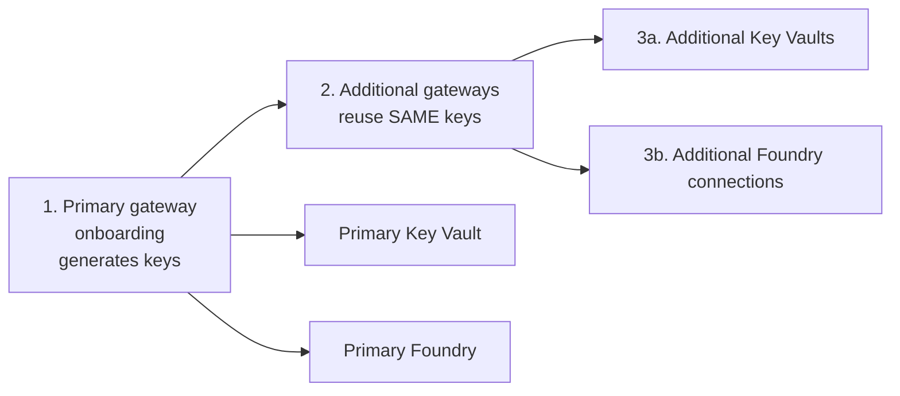

# 🛡️ Access Contract Business Continuity & Resiliency Guide

This guide explains the **optional** multi-instance capability of Citadel Access Contracts. It lets a **single** access contract be mirrored across **additional APIM gateways, Key Vaults, and Foundry instances** so the contract keeps working if the primary instance or region becomes unavailable.

> **Backward compatibility promise**: These features are 100% opt-in. Every new parameter defaults to empty. **Existing access contracts continue to deploy and behave exactly as before** — no parameter changes required. If you do nothing, nothing changes.

---

## 📌 When to use this

Use these features when you need the same AI use case to survive the loss of a single AI Gateway instance or region — for example:

- Active/active or active/passive APIM across two regions
- A global load balancer (Azure Front Door / Traffic Manager) in front of multiple gateways
- Credentials replicated into a secondary Key Vault for a DR region
- Foundry connections created in a secondary Foundry project

If you only run a single gateway, ignore this guide — the base [README.md](./README.md) already covers everything you need.

---

## 🧠 Core concepts

### 1. Consistent subscription key across gateways

The single most important guarantee: **the subscription key is generated once by the primary gateway and reused verbatim on every additional gateway.**

This means client applications use the **same `api-key`** no matter which gateway ultimately serves the request. A client can fail over from one gateway to another (or sit behind a global load balancer) without changing credentials.

This is achieved by:
1. Deploying the **primary** gateway first (creates the subscription, APIM generates the key).
2. Passing that key as an **explicit primary key** when creating the mirrored subscription on each additional gateway.

### 2. Global endpoint (optional)

`globalGatewayUrl` lets you record a single global entry point (e.g. an Azure Front Door / Traffic Manager hostname) as the endpoint stored in **all** Key Vault secrets and Foundry connections. When empty (default) the **primary APIM gateway URL** is used — the existing behavior.

### 3. Endpoint source selection for additional instances

Each additional Key Vault / Foundry entry can choose which endpoint URL it stores via `endpointSource`:

| `endpointSource` | Endpoint stored |
|------------------|-----------------|
| `'global'` | `globalGatewayUrl` |
| `'primary'` | Primary APIM gateway URL |
| `'secondary:<index>'` | The additional gateway at that 0-based index in `additionalApimGateways` |
| `''` (default / omitted) | `globalGatewayUrl` if set, otherwise the primary gateway URL |

> 🔑 **Per-asset endpoints are mirrored too.** For a multi-asset (`MULTI-`) contract, each additional Key Vault receives the **same set of secrets as the primary**: the single shared key plus **one endpoint secret per asset** (from `assetEndpoints` / `publishAllAssetEndpoints`). The selected `endpointSource` gateway base is applied to **every** per-asset endpoint URL, so a DR-region Key Vault holds the full, region-appropriate endpoint set for LLM + Tools + Agents under one shared key.

---

## 🔩 Parameters

All parameters are optional. Add them to your use-case `.bicepparam` file.

| Parameter | Type | Default | Description |
|-----------|------|---------|-------------|
| `globalGatewayUrl` | string | `''` | Global endpoint base used for all Key Vault secrets and Foundry connections. Empty = primary gateway URL. |
| `additionalApimGateways` | array | `[]` | Additional APIM gateways to mirror the contract into. Item: `{ subscriptionId, resourceGroupName, name }`. |
| `additionalKeyVaults` | array | `[]` | Additional Key Vaults to store endpoint + shared key. Item: `{ subscriptionId, resourceGroupName, name, endpointSource? }`. |
| `additionalFoundries` | array | `[]` | Additional Foundry instances to create APIM connections in. Item: `{ subscriptionId, resourceGroupName, accountName, projectName, endpointSource? }`. |

> The additional APIM gateways, Key Vaults, and Foundry projects **must already exist** — the same prerequisite that applies to the primary instances today. This package does not provision them.

---

## 🚀 Deployment order

The deployment is intentionally staged, enforced through Bicep output references and `dependsOn`:



1. **Primary gateway** onboarding runs first and produces the subscription key.
2. **Additional gateways** are created next, each reusing the primary key (via `explicitPrimaryKey`).
3. **Additional Key Vaults and Foundry connections** run last, after all gateways exist, so they store the shared key and the resolved endpoint.

This ordering is automatic — you do not need to sequence anything manually.

---

## 📝 Configuration examples

### Example 1: Two gateways behind a global endpoint

A global Front Door endpoint routes to a primary and a secondary APIM gateway. Both gateways share the same key; the primary Key Vault stores the global endpoint.

```bicep
param globalGatewayUrl = 'https://ai-gateway.contoso.com'

param additionalApimGateways = [
  {
    subscriptionId: '00000000-0000-0000-0000-000000000000'
    resourceGroupName: 'rg-apim-westeurope'
    name: 'apim-aihub-westeurope'
  }
]

// Primary Key Vault (existing param) now stores the global endpoint automatically
// because globalGatewayUrl is set.
param useTargetAzureKeyVault = true
```

### Example 2: Secondary Key Vault pointing at the secondary gateway

Store credentials in a DR-region Key Vault whose endpoint points directly at the secondary gateway (not the global endpoint), for region-pinned clients.

```bicep
param additionalApimGateways = [
  {
    subscriptionId: '00000000-0000-0000-0000-000000000000'
    resourceGroupName: 'rg-apim-westeurope'
    name: 'apim-aihub-westeurope'
  }
]

param additionalKeyVaults = [
  {
    subscriptionId: '00000000-0000-0000-0000-000000000000'
    resourceGroupName: 'rg-kv-westeurope'
    name: 'kv-aihub-westeurope'
    endpointSource: 'secondary:0'   // -> additionalApimGateways[0] gateway URL
  }
]
```

### Example 3: Secondary Foundry connection using the global endpoint

```bicep
param globalGatewayUrl = 'https://ai-gateway.contoso.com'

param additionalFoundries = [
  {
    subscriptionId: '00000000-0000-0000-0000-000000000000'
    resourceGroupName: 'rg-foundry-westeurope'
    accountName: 'foundry-westeurope'
    projectName: 'ai-project-dr'
    endpointSource: 'global'
  }
]
```

---

## 📤 Outputs

In addition to all existing outputs (unchanged), the following additive outputs are available (empty when the features are unused):

| Output | Description |
|--------|-------------|
| `globalGatewayUrl` | The global endpoint used (echo of the parameter). |
| `effectiveGatewayUrl` | The endpoint base actually applied to primary Key Vault/Foundry (global if set, else primary). |
| `additionalGatewayCount` | Number of additional gateways. |
| `additionalGateways` | Per additional gateway: `{ name, gatewayUrl, products[] }`. |
| `additionalKeyVaults` | Per additional Key Vault: `{ name, endpointSource }`. |
| `additionalFoundryConnections` | Per additional Foundry: `{ foundryAccount, foundryProject, connectionNames[] }`. |

---

## 🔄 Key rotation

For **zero-downtime subscription key rotation** — including how both keys are kept in sync across all mirrored gateways — see the dedicated [Access Contract Key Rotation Guide](./access-contract-key-rotation-guide.md).

In a multi-gateway contract, the primary gateway owns both keys and syncs **both** the primary and secondary keys verbatim to every additional gateway, so a client uses the same active key regardless of which gateway serves the request. The 3-step rotation flow (switch → confirm → regenerate) works across all gateways at once.

---

## ⚠️ Notes & troubleshooting

- **Out-of-range `secondary:<index>`**: `endpointSource: 'secondary:<index>'` must reference an entry that exists in `additionalApimGateways`. The index is **0-based** (`secondary:0` = first additional gateway). An out-of-range index **fails fast at deployment time** with an index error — there is intentionally no silent fallback, so a misconfiguration surfaces immediately. Double-check the index matches the order of `additionalApimGateways`.
- **Additional Key Vaults are independent of `useTargetAzureKeyVault`**: entries in `additionalKeyVaults` are always written when present, regardless of the primary `useTargetAzureKeyVault` flag. The `useTargetAzureKeyVault` flag only governs the **primary** Key Vault.
- **Cross-subscription / cross-region**: additional gateways, Key Vaults, and Foundry instances may live in different subscriptions and resource groups. Ensure the deploying identity has the required roles (APIM Service Contributor, Key Vault Secrets Officer, Foundry RG Contributor) in each target.
- **Deployment name length**: mirrored deployments are named `onboard-add<gatewayIndex>-<serviceCode>-<BU>-<UseCase>-<ENV>`. Keep business unit / use case names concise to stay within Azure's 64-character deployment-name limit.
- **Product & subscription names are identical** across all gateways (mirrored contract), so clients experience a single logical contract.

---

## 🔗 Related

- [Access Contracts README](./README.md)
- [Contract Quick Reference Guide](./contract-quick-reference-guide.md)
- [Access Contract Policy Guide](./citadel-access-contracts-policy.md)
</content>
</invoke>
