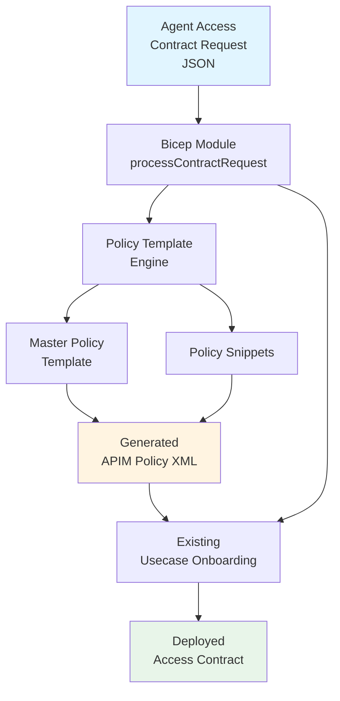
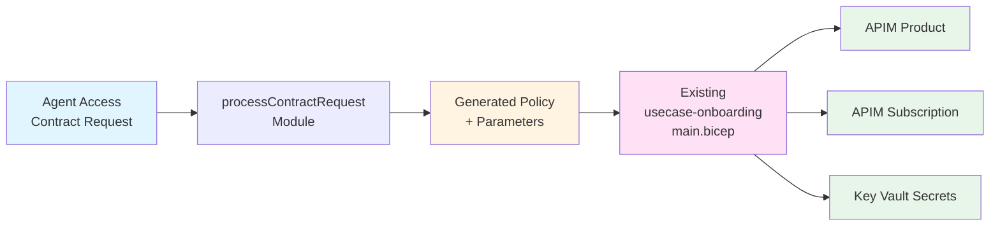

# Agent Access Contract Request

## Overview

The **Agent Access Contract Request** system simplifies the creation of AI Hub Gateway access contracts by providing a user-friendly JSON-based interface. Similar to how Certificate Signing Requests (CSR) work for TLS certificates, this system allows requesters to specify their access requirements in a simple JSON format, which is then automatically converted into the necessary technical files (bicepparam and APIM policy XML) for deployment.

## Problem Statement

Traditional Citadel Access Contracts require:
- A technically valid bicepparam file
- A hand-crafted APIM policy XML file

This approach has several challenges:
- Requires deep technical knowledge of APIM policies
- Error-prone manual XML creation
- Difficult to maintain and update
- Not user-friendly for business teams

## Solution

The Agent Access Contract Request system provides:
- 📝 **User-friendly JSON schema** for describing access requirements
- 🔄 **Automatic generation** of bicepparam and APIM policy files
- 🎯 **Template-based approach** with placeholders for extensibility
- ✅ **Validation** through JSON schema
- 📚 **Clear examples** for common scenarios

## Architecture



## JSON Schema

The Agent Access Contract Request uses a well-defined JSON schema with the following main sections:

### 1. Contract Metadata
Basic information about the contract request:
- `agentName`: Name of the agent (e.g., "HRAgent", "SalesAgent")
- `businessUnit`: Business unit or department
- `environment`: Target environment (DEV, TEST, PROD)
- `description`: Brief description of the agent's purpose
- `owner`: Email or ID of the contract owner

### 2. Access Requirements
AI service access requirements:
- `models`: Array of AI models with optional per-model TPM and quotas
  - `modelName`: Model deployment name (e.g., "gpt-4o")
  - `tokensPerMinute`: Token limit per minute for this model
  - `tokenQuota`: Total token quota for this model
  - `tokenQuotaPeriod`: Period for quota (Hourly, Daily, Weekly, Monthly)
- `globalLimits`: Global limits across all models
  - `tokensPerMinute`: Total TPM across all models
  - `tokenQuota`: Total token quota
  - `tokenQuotaPeriod`: Period for global quota
- `allowedBackends`: List of allowed backend IDs (empty = all allowed)

### 3. Content Safety
Content safety and moderation settings:
- `enabled`: Enable content safety checks
- `backendId`: Content safety backend ID
- `shieldPrompt`: Enable prompt shielding
- `categories`: Array of safety categories with thresholds (0-8)
  - Supported categories: Hate, Violence, Sexual, SelfHarm
- `applicableModels`: Models to which content safety applies

### 4. PII Handling
PII (Personally Identifiable Information) handling:
- `enabled`: Enable PII anonymization/deanonymization
- `confidenceThreshold`: Confidence threshold for detection (0.0-1.0)
- `detectionLanguage`: Language for PII detection
- `entityCategoryExclusions`: Entity categories to exclude
- `customRegexPatterns`: Custom regex patterns for PII detection
- `stateSaving`: Enable PII state saving to Event Hub

### 5. Usage Tracking
Usage tracking and custom dimensions:
- `customDimensions`: Custom dimension header names (up to 10)
- `trackEndUserId`: Track end user ID from header
- `trackSessionId`: Track session ID from header
- `trackAppId`: Track application ID from header

### 6. Alerts
Alert configuration:
- `throttlingEvents`: Enable alerts for throttling events
- `contentSafetyViolations`: Enable alerts for safety violations
- `unauthorizedAccess`: Enable alerts for unauthorized access

### 7. Additional Policies
- `customInboundPolicies`: Array of custom inbound policy XML snippets
- `customOutboundPolicies`: Array of custom outbound policy XML snippets

## Usage

### Prerequisites

- Azure subscription with appropriate permissions
- Existing APIM instance with AI service APIs configured
- Azure Key Vault for storing secrets
- Azure CLI or PowerShell for deployment

### Quick Start

1. **Create your Agent Access Contract Request JSON file**

Choose an example from the `examples/` folder or create your own based on the schema:
- `examples/hr-agent-request.json` - Full-featured example with PII handling and content safety
- `examples/sales-agent-request.json` - Simple example with basic access

2. **Create a deployment parameters file**

Copy one of the example parameter files:
- `examples/hr-agent.parameters.json`
- `examples/sales-agent.parameters.json`

Update the placeholders:
```json
{
  "apim": {
    "subscriptionId": "your-subscription-id",
    "resourceGroupName": "your-apim-rg",
    "name": "your-apim-name"
  },
  "keyVault": {
    "subscriptionId": "your-subscription-id",
    "resourceGroupName": "your-kv-rg",
    "name": "your-kv-name"
  }
}
```

3. **Deploy the contract**

Using Azure CLI:
```bash
az deployment sub create \
  --name hr-agent-contract \
  --location eastus \
  --template-file infra/usecase-onboarding/base-access-contract-request/main.bicep \
  --parameters @infra/usecase-onboarding/base-access-contract-request/examples/hr-agent.parameters.json
```

Using PowerShell:
```powershell
New-AzSubscriptionDeployment `
  -Name hr-agent-contract `
  -Location eastus `
  -TemplateFile infra/usecase-onboarding/base-access-contract-request/main.bicep `
  -TemplateParameterFile infra/usecase-onboarding/base-access-contract-request/examples/hr-agent.parameters.json
```

4. **Verify deployment**

Check the outputs:
- `generatedPolicyXml`: The generated APIM policy XML
- `productId`: The created APIM product ID
- `apimGatewayUrl`: The APIM gateway URL
- `subscriptions`: The created subscription details with Key Vault secret names

## Examples

### Example 1: HR Agent with Full Security Features

**Requirements:**
- Access to gpt-4o, text-embedding-3-large, and deepseek-r1
- Model-specific TPM and quotas
- Content safety level 4 with prompt shielding
- PII anonymization/deanonymization
- 2 custom dimensions for usage tracking
- Alerts enabled for throttling events

See: `examples/hr-agent-request.json`

**Generated Policy Features:**
- ✅ Backend restrictions (openai-backend-0 only)
- ✅ Model access restrictions (3 models)
- ✅ Content safety with 4 categories at level 4
- ✅ Per-model token limits (10K, 5K, 3K TPM)
- ✅ Global token limit (15K TPM, 150K monthly)
- ✅ PII anonymization with custom regex patterns
- ✅ PII deanonymization with state saving
- ✅ Usage tracking with custom dimensions

### Example 2: Sales Agent with Basic Access

**Requirements:**
- Access to gpt-4o and text-embedding-3-large
- Total 1000 TPM and 100000 tokens monthly
- No content safety or PII handling

See: `examples/sales-agent-request.json`

**Generated Policy Features:**
- ✅ Model access restrictions (2 models)
- ✅ Global token limit (1K TPM, 100K monthly)
- ✅ Minimal configuration for fast deployment

## Policy Template System

### Master Template

The master policy template (`templates/master-policy-template.xml`) contains placeholders that are replaced during processing:

```xml
<policies>
  <inbound>
    <base />
    <!-- PLACEHOLDER:ALLOWED_BACKENDS -->
    <!-- PLACEHOLDER:MODEL_RESTRICTIONS -->
    <!-- PLACEHOLDER:CONTENT_SAFETY -->
    <!-- PLACEHOLDER:MODEL_SPECIFIC_TOKEN_LIMITS -->
    <!-- PLACEHOLDER:GLOBAL_TOKEN_LIMITS -->
    <!-- PLACEHOLDER:PII_ANONYMIZATION -->
    <!-- PLACEHOLDER:USAGE_TRACKING_VARIABLES -->
    <!-- PLACEHOLDER:CUSTOM_INBOUND_POLICIES -->
  </inbound>
  <backend>
    <base />
  </backend>
  <outbound>
    <base />
    <!-- PLACEHOLDER:PII_DEANONYMIZATION -->
    <!-- PLACEHOLDER:CUSTOM_OUTBOUND_POLICIES -->
  </outbound>
  <on-error>
    <base />
  </on-error>
</policies>
```

### Policy Snippets

Policy snippets are stored in `templates/snippets/` and contain template variables that are replaced with actual values:

1. **allowed-backends.xml**: Backend restrictions
   - Template vars: `{{ALLOWED_BACKENDS}}`

2. **model-restrictions.xml**: Model access control
   - Template vars: `{{ALLOWED_MODELS}}`

3. **content-safety.xml**: Content moderation
   - Template vars: `{{BACKEND_ID}}`, `{{SHIELD_PROMPT}}`, `{{APPLICABLE_MODELS}}`, `{{CATEGORIES}}`

4. **model-specific-token-limits.xml**: Per-model token limits
   - Template vars: `{{MODEL_TOKEN_LIMIT_CASES}}`

5. **global-token-limits.xml**: Global token limits
   - Template vars: `{{TOKENS_PER_MINUTE}}`, `{{TOKEN_QUOTA_PARAMS}}`

6. **pii-anonymization.xml**: PII anonymization
   - Template vars: `{{CONFIDENCE_THRESHOLD}}`, `{{ENTITY_EXCLUSIONS}}`, `{{DETECTION_LANGUAGE}}`, `{{REGEX_PATTERNS}}`

7. **pii-deanonymization.xml**: PII deanonymization
   - Template vars: `{{STATE_SAVING_BLOCK}}`

8. **usage-tracking-variables.xml**: Usage tracking
   - Template vars: `{{USAGE_TRACKING_VARIABLES}}`

## Extensibility

The system is designed to be easily extensible:

### Adding New Policy Options

1. **Create a new policy snippet** in `templates/snippets/`
2. **Add a placeholder** in `master-policy-template.xml`
3. **Update the JSON schema** to include new parameters
4. **Add processing logic** in `modules/processContractRequest.bicep`

### Example: Adding Rate Limiting by IP

1. Create `templates/snippets/ip-rate-limit.xml`:
```xml
<rate-limit-by-key calls="{{CALLS}}" 
                   renewal-period="{{PERIOD}}" 
                   counter-key="@(context.Request.IpAddress)" />
```

2. Add to schema:
```json
{
  "ipRateLimit": {
    "type": "object",
    "properties": {
      "enabled": { "type": "boolean" },
      "calls": { "type": "integer" },
      "renewalPeriod": { "type": "integer" }
    }
  }
}
```

3. Process in Bicep module and add to master template

## Troubleshooting

### Common Issues

1. **Deployment fails with authorization errors**
   - Ensure your identity has APIM Contributor and Key Vault Secret Set permissions

2. **Policy validation errors**
   - Check the generated policy XML output
   - Verify all required APIM fragments exist (e.g., pii-anonymization, pii-deanonymization)

3. **Model access denied (401)**
   - Verify model names match the deployment IDs in APIM
   - Check that models are included in the `accessRequirements.models` array

4. **Token limits not working**
   - Confirm token limit values are specified in the contract request
   - Check APIM logs for policy execution details

### Validation

To validate your JSON before deployment:
```bash
# Using a JSON schema validator
npm install -g ajv-cli
ajv validate -s schemas/agent-access-contract-request.schema.json -d examples/hr-agent-request.json
```

## Best Practices

1. **Start Simple**: Begin with basic access requirements and add features incrementally
2. **Use Templates**: Copy existing examples and modify them for your needs
3. **Test in DEV**: Always test contracts in a development environment first
4. **Version Control**: Keep contract JSON files in source control
5. **Document Ownership**: Always specify an owner in contract metadata
6. **Review Generated Policies**: Check the generated policy XML before production deployment
7. **Monitor Usage**: Enable usage tracking and alerts for production contracts
8. **Secure PII**: Only enable PII handling when necessary and ensure proper backend configuration

## Integration with Existing Infrastructure

The Agent Access Contract Request system integrates seamlessly with the existing usecase-onboarding infrastructure:



## Related Documentation

- [Use Case Onboarding Guide](../README.md)
- [APIM Configuration Guide](../../../guides/apim-configuration.md)
- [PII Masking in APIM Guide](../../../guides/pii-masking-apim.md)
- [Dynamic Throttling Assignment Guide](../../../guides/dynamic-throttling-assignment.md)

## Support

For questions, issues, or feature requests:
1. Check the examples in the `examples/` folder
2. Review the JSON schema in `schemas/agent-access-contract-request.schema.json`
3. Examine the generated policy XML in deployment outputs
4. Consult the main [repository documentation](../../../README.md)
