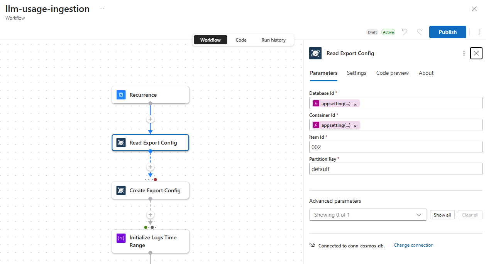
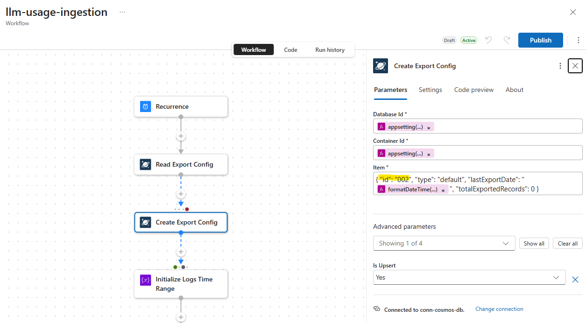
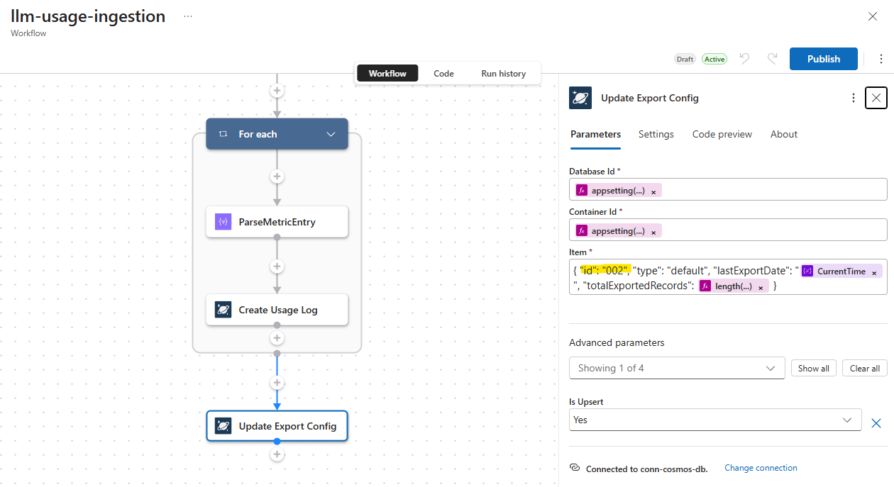

# Citadel Cosmos Global Multi-Master Sync

## Overview

This submodule links **two or more independent Citadel Governance Hub accelerator deployments** by updating each deployment's existing Cosmos DB account to a shared multi-region, multi-write topology.

The result is:

- Each gateway deployment remains operationally independent in its own region.
- Each linked Cosmos DB account is configured with the same write-region set.
- Usage data written in any configured region is available globally through Cosmos DB global distribution.

This complements:

- `citadel-access-contracts` resiliency mode (deploy one access contract to multiple gateways).
- `backend-contract` routing to distribute traffic across different gateway implementations.

---

## Prerequisites

It is critical to configure the Logic Apps in the secondary regions to the following:

### `llm-usage-ingestion` workflow

You must update 3 tasks to use a different `Export-Config` id (which tracks the last time the workflow exported usage data to Cosmos DB). This ensures that each region's workflow does not overwrite the other region's usage data.

Below are the screenshots of the three tasks that need to be updated (you can increment instead of `002`, e.g., `003`, `004`, etc. for additional regions):

This is the task that checks existing exports:


This is the one that creates the export for the first time:


This is the task that updates the export for subsequent runs:


## What this module updates

For every gateway implementation you provide, the module updates the existing Cosmos DB account to:

- Enable `enableMultipleWriteLocations`.
- Configure a shared ordered `locations` list (primary region first, then peer regions).
- Optionally enable automatic failover.

> This module intentionally updates **existing** accounts only. It does not create new Cosmos DB accounts.

---

## Folder structure

```text
citadel-cosmos-global-multi-master-sync/
├── main.bicep
├── main.bicepparam
├── README.md
└── modules/
    └── cosmos-global-multi-master-link.bicep
```

---

## Required input model

`gatewayImplementations` (minimum 2 entries):

```bicep
param gatewayImplementations = [
  {
    name: 'gateway-se'
    subscriptionId: '<sub-id>'
    resourceGroupName: 'rg-aihub-se-prod'
    cosmosDbAccountName: 'cosmos-aihub-se-prod'
    region: 'swedencentral'
  }
  {
    name: 'gateway-us'
    subscriptionId: '<sub-id>'
    resourceGroupName: 'rg-aihub-us-prod'
    cosmosDbAccountName: 'cosmos-aihub-us-prod'
    region: 'eastus2'
  }
]
```

Optional:

- `additionalWriteRegions`: Add extra write regions for all linked accounts.
- `systemManagedFailover`: Enable or disable automatic failover.
- `isZoneRedundant`: Set location `isZoneRedundant` flag for all configured regions.

---

## Deployment

From this folder:

```bash
az deployment sub create \
  --name citadel-cosmos-global-sync \
  --location swedencentral \
  --template-file main.bicep \
  --parameters main.bicepparam
```

---

## Approach and capability design

1. You select 2+ existing gateway implementations.
2. The module derives a shared global write-region set from those implementations.
3. Each implementation's Cosmos DB account is updated with the same region topology and multi-write enabled.
4. Access contracts can be mirrored to multiple gateways, while `backend-contract` policies route requests across gateways.
5. Usage writes from regional gateways are globally available through Cosmos DB multi-master replication.

This gives you regional gateway autonomy with a globally synchronized usage data plane.

---

## Operational notes

- Run `what-if` before applying in production.
- Ensure deployer permissions include Cosmos DB account write on every listed resource group/subscription.
- Region list changes can trigger account-level replication operations; apply during controlled windows.
