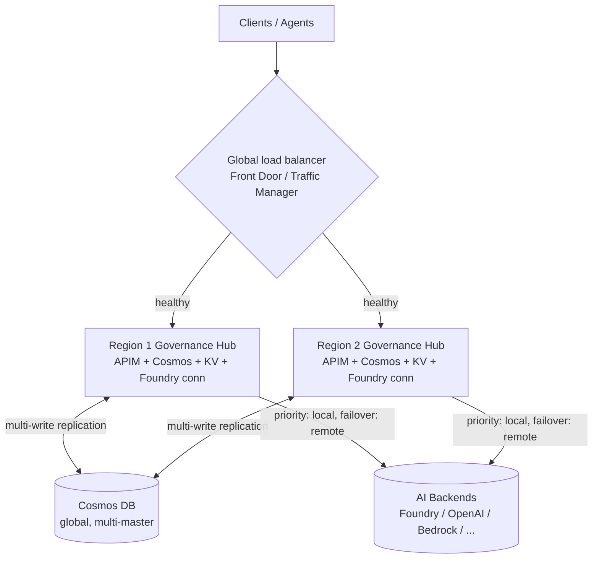
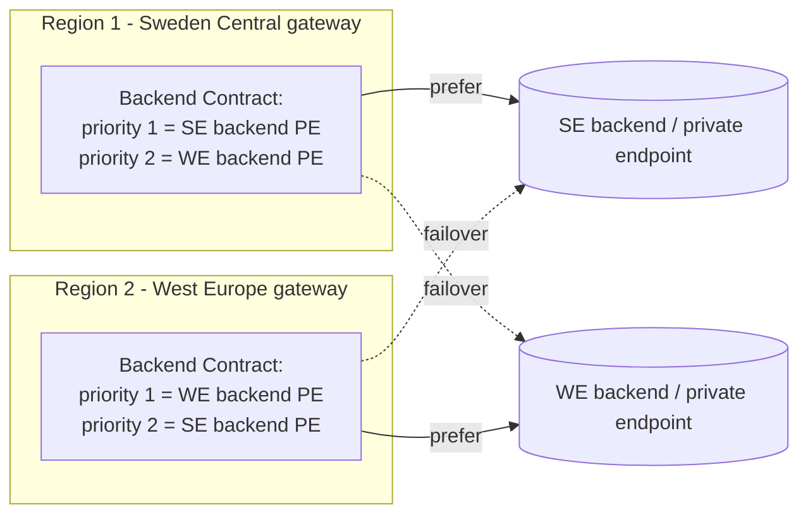
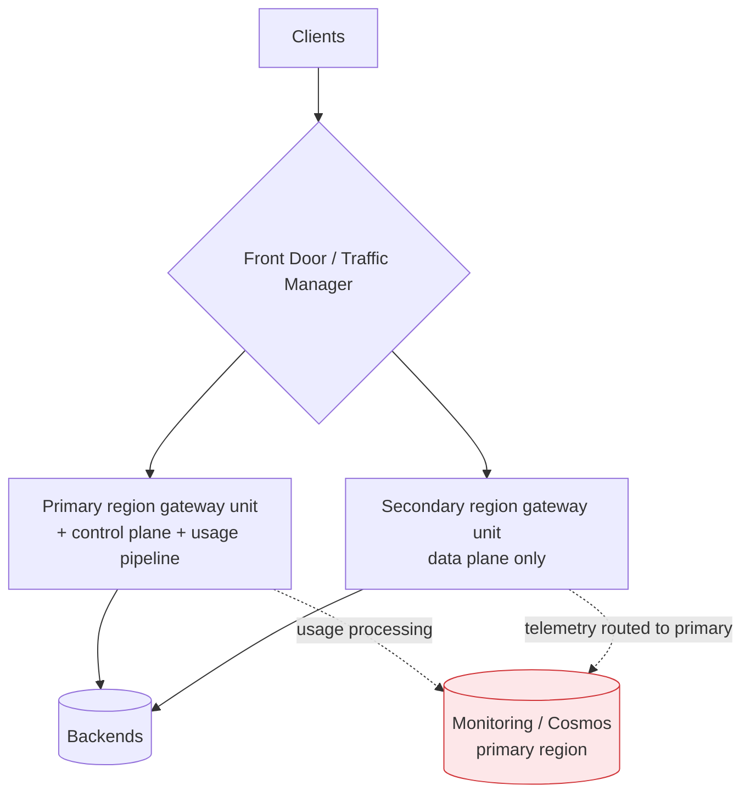
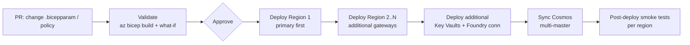

# 🛡️ Business Continuity & Disaster Recovery (BC/DR) Guide

> **How to keep the Citadel Governance Hub — the governed front door in front of every LLM — available when a whole region, service, or control plane fails.** This guide covers **planning** a BC/DR strategy, the **two deployment topologies** the accelerator supports, **global routing and traffic management**, **DevOps alignment**, and how this all connects to **backend resiliency**.

This guide is about the **resiliency of the Governance Hub itself** (the gateway compute plane, its usage/data plane, and its configuration plane). It is deliberately scoped to the hub. It is **not** about the resiliency of the AI backends behind it (Azure OpenAI, Microsoft Foundry, AWS Bedrock, Google Gemini, Anthropic Claude, etc.). For that, pair this guide with the [Resiliency Guide](./resiliency-guide.md), which covers circuit breaking, session affinity, automated failover, and error handling at the backend level.

> **Golden rule.** A resilient gateway in front of a fragile backend still fails, and a resilient backend behind a single-region gateway is unreachable when that region goes down. **You need both.** Use this guide for the hub, and the [Resiliency Guide](./resiliency-guide.md) for the backends.

---

## 📖 Contents

1. [BC/DR at a glance](#1-bcdr-at-a-glance)
2. [Planning your BC/DR strategy](#2-planning-your-bcdr-strategy)
3. [Deployment topologies](#3-deployment-topologies)
   - [Option 1 (recommended): Multiple full deployments](#option-1-recommended--multiple-full-deployments)
   - [Option 2: Single deployment with Premium APIM multi-region](#option-2--single-deployment-with-premium-apim-multi-region)
   - [Option comparison](#option-comparison)
4. [Global routing & traffic management](#4-global-routing--traffic-management)
5. [Networking through an Enterprise Connectivity Hub](#5-networking-through-an-enterprise-connectivity-hub)
6. [DevOps alignment](#6-devops-alignment)
7. [Backend resiliency (scope boundary)](#7-backend-resiliency-scope-boundary)
8. [Reference implementation walkthrough](#8-reference-implementation-walkthrough)
9. [Operational runbook](#9-operational-runbook)
10. [Related guides & modules](#10-related-guides--modules)

---

## 1. BC/DR at a glance

The Governance Hub has **three logical planes**, and a BC/DR plan must address each one independently:

| Plane | What it is | What fails if a region is lost | Primary BC/DR mechanism |
|---|---|---|---|
| **Compute / request plane** | The APIM gateway that proxies, authenticates, and governs every LLM call. | Clients can't reach a gateway to make governed calls. | Multiple gateways (Option 1) **or** APIM Premium multi-region units (Option 2), fronted by a global load balancer. |
| **Data / usage plane** | The Cosmos DB account that stores usage/telemetry consolidation for chargeback, quotas, and reporting. | Usage writes fail or telemetry is lost. | Cosmos DB global replication with **multiple write regions** (Option 1) — see [`citadel-cosmos-global-multi-master-sync`](../bicep/infra/citadel-cosmos-global-multi-master-sync/README.md). |
| **Configuration / control plane** | Access Contracts (products, subscriptions, keys), Backend Contracts (pools, routing), policies, named values, Key Vault, Foundry connections. | You can't change configuration; in Option 2 the control plane is region-bound. | Config-as-code re-applied per region (Option 1) **or** shared control plane pinned to the primary region (Option 2). |



**The three numbers every BC/DR plan needs:**

- **RTO (Recovery Time Objective)** — how fast the gateway must be usable again after a region loss.
- **RPO (Recovery Point Objective)** — how much usage/telemetry data you can afford to lose.
- **RLO (Recovery Level Objective)** — what *degraded* service is acceptable (e.g., "requests still served, but no new use-case onboarding until the primary control plane returns").

---

## 2. Planning your BC/DR strategy

A credible BC/DR plan is built in four steps before any Bicep is deployed.

### Step 1 — Risk assessment

Enumerate the failure modes the hub must survive and their blast radius:

| Failure mode | Blast radius | Addressed by |
|---|---|---|
| Single AZ failure in a region | One availability zone | Zone-redundant APIM + `isZoneRedundant` Cosmos regions (both options). |
| Full region outage | An entire Azure region | **Second region** (Option 1) or Premium secondary unit (Option 2). |
| APIM control-plane / management outage | Gateway config changes | Option 1 keeps each region's control plane independent; Option 2 degrades to data-plane-only in secondaries. |
| Cosmos DB regional outage | Usage/telemetry writes | Multi-write regions with automatic failover. |
| Monitoring / usage pipeline outage | Telemetry accuracy | Option 1 isolates per region; Option 2 concentrates risk in the primary (see RPO note). |
| Backend/provider outage | The LLM itself | **Out of scope here** → [Resiliency Guide](./resiliency-guide.md) (pools, failover, aliases). |

### Step 2 — Business impact analysis (BIA)

For each onboarded use case (access contract), classify criticality and map it to RTO/RPO:

| Tier | Example | RTO target | RPO target | Topology fit |
|---|---|---|---|---|
| **Tier 0 — mission critical** | Real-time customer-facing agent | seconds → low minutes | ~0 (no usage loss tolerated) | Option 1, active/active, multi-write Cosmos. |
| **Tier 1 — business critical** | Internal copilots, ticket triage | minutes | minutes | Option 1 or Option 2 Premium. |
| **Tier 2 — standard** | Batch summarization, analytics | hours | hours | Single region + zone redundancy may suffice. |

### Step 3 — Define recovery objectives

Turn the BIA into explicit, testable targets, for example:

- **RTO ≤ 60s** for Tier 0 → requires a global load balancer with automatic health-based failover (no manual DNS change).
- **RPO ≈ 0** for usage data → requires Cosmos DB **multi-write** so a regional loss never blocks writes.
- **Control-plane RTO ≤ 15 min** → requires config-as-code in a pipeline that can re-apply to a surviving region on demand (Option 1) or documented acceptance that control-plane edits wait for the primary region (Option 2).

### Step 4 — Choose a topology

Map objectives → topology using the [comparison table](#option-comparison). As a rule of thumb: **Tier 0 / RPO≈0 / independent control plane → Option 1**; **simpler operations, willing to run Premium, tolerant of primary-region control-plane dependency → Option 2**.

---

## 3. Deployment topologies

### Option 1 (recommended) — Multiple full deployments

Deploy **two (or more) complete, independent Citadel Governance Hub instances** in different regions (e.g., Sweden Central + West Europe, or Sweden Central + East US 2). Each region has its own APIM, Cosmos DB, Key Vault, monitoring, and Foundry connections and runs autonomously.

**Why this is recommended**

- **True regional autonomy** — each region has its **own control plane**. A region loss (including its APIM management plane) does not stop you from onboarding use cases or changing routing in the surviving region.
- **Consolidated usage data** — link the per-region Cosmos DB accounts into one **global, multi-write** topology so usage written in any region is globally readable for chargeback and reporting. This is exactly what [`citadel-cosmos-global-multi-master-sync`](../bicep/infra/citadel-cosmos-global-multi-master-sync/README.md) automates.
- **One logical access contract, many gateways** — the [Access Contract resiliency feature](../bicep/infra/citadel-access-contracts/access-contract-resiliency-guide.md) mirrors a single contract across additional gateways, Key Vaults, and Foundry instances while **reusing the same subscription `api-key`**. Clients use one key regardless of which region serves them — ideal behind a global load balancer.
- **Cost-flexible tier** — works on **APIM Standard v2 or higher**; you do **not** need Premium.

**Per-region backend routing (priority + failover).** Because each region owns its Backend Contract, you can bias routing so each region **prefers local backends and fails over to the remote region's backends**:



This uses the same backend-pool **priority/weight** mechanics documented in the [Resiliency Guide → Automated Failover](./resiliency-guide.md#3-automated-failover): lower `priority` = preferred; on `429`/`5xx` APIM moves to the next member. The only difference is that the *ordering of priorities is inverted per region* so each region has a "local-first, remote-second" preference.

**Data plane — Cosmos DB multi-write.** Link each region's existing Cosmos account into one write-region set:

```bicep
// citadel-cosmos-global-multi-master-sync/main.bicepparam
param gatewayImplementations = [
  { name: 'gateway-se', subscriptionId: '<sub>', resourceGroupName: 'rg-aihub-se-prod', cosmosDbAccountName: 'cosmos-aihub-se-prod', region: 'swedencentral' }
  { name: 'gateway-we', subscriptionId: '<sub>', resourceGroupName: 'rg-aihub-we-prod', cosmosDbAccountName: 'cosmos-aihub-we-prod', region: 'westeurope' }
]
param systemManagedFailover = true   // automatic Cosmos regional failover
param isZoneRedundant = true         // AZ resilience within each region
```

Deploy at subscription scope:

```bash
az deployment sub create \
  --name citadel-cosmos-global-sync \
  --location swedencentral \
  --template-file main.bicep \
  --parameters main.bicepparam
```

With `enableMultipleWriteLocations` on, a regional gateway keeps **writing usage locally** even if the peer region is down, and the data becomes globally visible once replication catches up → **RPO ≈ 0** for usage telemetry.

### Option 2 — Single deployment with Premium APIM multi-region

Deploy a **single** Governance Hub whose APIM is on the **Premium tier**, and add [APIM's native multi-region gateway units](https://learn.microsoft.com/azure/api-management/api-management-howto-deploy-multi-region). One region is the **primary** (holds the control/management plane); other regions add **gateway units** that serve traffic.

**Behavior during a failure**

- **Data plane stays up in every region.** Each regional gateway unit continues **proxying requests to backends** independently. If the primary region is impacted, secondary regions **keep serving traffic**.
- **Shared control plane.** All regions share **one** APIM configuration — simpler to manage (one contract set, one policy set). **But** control-plane operations (publishing config, editing products/policies, rotating keys through APIM) **depend on the primary region's availability**. If the primary region is down, secondaries continue serving the *last-published* configuration but you **cannot push changes** until it recovers.
- **Premium required.** Multi-region deployment is a **Premium-tier** capability and carries **higher cost** than Standard v2.
- **⚠️ Usage-data caveat.** Usage/telemetry **processing still runs in the primary region**. If the monitoring/usage pipeline in the primary region becomes unavailable, you can experience **loss of usage telemetry** (higher RPO for the data plane) even while requests are still being served. This is the key trade-off versus Option 1's multi-write Cosmos.



### Option comparison

| Dimension | **Option 1 — Multiple full deployments** *(recommended)* | **Option 2 — Premium multi-region** |
|---|---|---|
| APIM tier | **Standard v2 or higher** | **Premium only** |
| Control plane | **Independent per region** (survives primary loss) | **Shared**, bound to primary region |
| Data / usage plane | Cosmos **multi-write**, per-region resilient (**RPO≈0**) | Usage processing in **primary region** (**telemetry loss risk**) |
| Config management | Config-as-code applied per region (pipeline recommended) | Single shared config (simpler day-to-day) |
| Request-plane failover | Global LB across independent gateways | Native APIM multi-region + global LB |
| Per-region backend bias | **Yes** — dedicated Backend Contract per region | Shared backend config (less per-region nuance) |
| Cost profile | Pay per full stack per region, but cheaper APIM tier | Premium units per region |
| Operational complexity | Higher (N stacks, needs pipeline discipline) | Lower (one stack) |
| Best for | Tier 0/1, strict RPO, control-plane autonomy | Simpler ops, Premium-acceptable, tolerant of primary-region control-plane dependency |

---

## 4. Global routing & traffic management

Regardless of topology, clients should hit **one stable hostname** that automatically routes to a **healthy** gateway. Use a global load balancer — **Azure Front Door** (recommended for HTTP(S): anycast, WAF, TLS offload, path routing) or **Azure Traffic Manager** (DNS-based, protocol-agnostic).

### 4.1 Health probes

Configure the global LB to probe each gateway continuously and remove unhealthy regions from rotation automatically:

- **Probe target:** a lightweight, unauthenticated health route on APIM (e.g., a `/status-0123456789abcdef` style health endpoint or a dedicated health API operation) that returns `200` only when the gateway can serve requests.
- **Interval / threshold:** tune to your RTO. For Tier 0 (RTO ≤ 60s), use short intervals (e.g., 30s) and a low unhealthy threshold so failover is fast.
- **What "healthy" means:** the probe should validate the gateway can actually reach at least one backend pool, not just that APIM's front end is up — otherwise you route to a gateway that 502s every call.

### 4.2 DNS / endpoint failover

- **Front Door:** clients use the Front Door hostname; Front Door serves from the nearest **healthy** origin and fails over transparently — **no DNS TTL wait**.
- **Traffic Manager:** uses DNS with **Priority** (active/passive) or **Performance** (latency-based, active/active) routing. Remember DNS **TTL** adds to effective RTO — keep TTL low (e.g., 30–60s) for fast failover.
- **Same key everywhere:** with Option 1's [Access Contract resiliency](../bicep/infra/citadel-access-contracts/access-contract-resiliency-guide.md), the subscription `api-key` is identical across gateways, so a client redirected by the global LB **authenticates unchanged**. Record the global LB hostname as `globalGatewayUrl` so Key Vault secrets and Foundry connections hand out the **global endpoint** rather than a region-pinned one:

```bicep
// In the use-case access contract .bicepparam
param globalGatewayUrl = 'https://ai-gateway.contoso.com'   // Front Door / Traffic Manager hostname
param additionalApimGateways = [
  { subscriptionId: '<sub>', resourceGroupName: 'rg-apim-westeurope', name: 'apim-aihub-westeurope' }
]
```

### 4.3 Routing strategy per tier

| Client / tier | Recommended global routing |
|---|---|
| Tier 0 active/active | Front Door with latency routing + health probes → nearest healthy region. |
| Tier 1 active/passive | Traffic Manager **Priority** routing → primary until unhealthy, then secondary. |
| Region-pinned client (data residency) | Point the client (or a secondary Key Vault entry, `endpointSource: 'secondary:<index>'`) at a **specific** region's gateway. |

---

## 5. Networking through an Enterprise Connectivity Hub

In an **Azure Enterprise Landing Zone**, the 2+ gateway regions should be wired together through a **central connectivity hub** (hub-and-spoke or Azure Virtual WAN) rather than as isolated islands. This gives you one place to enforce firewalling, routing, and private DNS across regions. The accelerator's two network patterns (hub-based and hub-spoke-hub) are described in the [Network Architecture guide](./network-approach.md); this section adds the **multi-region** dimension.

**Principles:**

1. **Connect every gateway region to the connectivity hub.** Each regional Governance Hub spoke peers to the (regional) hub VNet; the regional hubs interconnect via the enterprise backbone (Global VNet Peering or Virtual WAN). This lets agents in any spoke reach any gateway region, and lets gateways reach backends anywhere.

2. **Backends must be reachable from *all* gateway regions.** This is the most important networking rule for BC/DR. A gateway can only fail over to a remote backend if it can *reach* it on the network. **Do not** assume a backend is only reachable from its own region.

3. **Private Endpoints per gateway region, independent of where the backend lives.** A Foundry/Azure OpenAI resource deployed in **one** region can expose a **private endpoint in each gateway region**. For example:

   > One Foundry account in **Sweden Central** can have **two private endpoints** — one in **Sweden Central** and one in **West Europe** — so **both** gateway regions reach the same Foundry privately. The Foundry resource does not need to be redeployed per region; you just add a private endpoint (and the matching Private DNS zone record) in each gateway region's network.

   ```mermaid
   flowchart LR
     subgraph SEnet[Sweden Central network]
       SEGW[APIM gateway SE] --> SEPE[PE → Foundry SE]
     end
     subgraph WEnet[West Europe network]
       WEGW[APIM gateway WE] --> WEPE[PE → Foundry SE]
     end
     SEPE --> FND[(Foundry account<br/>Sweden Central)]
     WEPE --> FND
   ```

4. **Different priority routing per region.** Combine reachability with the [per-region Backend Contract priority](#option-1-recommended--multiple-full-deployments): each region **prefers the network-closest backend private endpoint** (lower latency, egress cost) and **fails over** to the remote one. So "reachable from all regions" + "prioritized per region" together give you both resilience *and* efficiency.

5. **Private DNS consistency.** Ensure the Private DNS zones (e.g., `privatelink.openai.azure.com`, `privatelink.cognitiveservices.azure.com`, Cosmos, Key Vault) resolve correctly in **every** gateway region — typically by linking the zones (or forwarding) through the connectivity hub. A failover is useless if the surviving region can't resolve the backend's private IP.

---

## 6. DevOps alignment

The Governance Hub is **code-as-policy**: everything — access contracts, backend contracts, policies, Cosmos linking — is expressed as Bicep parameter/config files and applied with simple `az deployment` commands. This means BC/DR configuration is **inherently reproducible**. You have two operating models:

### Option A — Manual `az` commands (supported)

You can absolutely run the deployments by hand, region by region:

```bash
# Region 1
az deployment sub create --name onboard-sales-assistant-se \
  --location swedencentral --template-file main.bicep \
  --parameters contracts/sales/assistant/prod/main.bicepparam
```

This is fine for small footprints, labs, or initial bring-up. It does **not** scale well to N regions and multiple use cases — it invites drift and human error at exactly the moment (a live incident) when you least want them.

### Option B — CI/CD pipeline (recommended)

For any production, multi-region footprint, drive all changes through a **CI/CD pipeline** (GitHub Actions or Azure DevOps). This is the recommended approach because it delivers **consistency across regions** and removes manual error during critical operations.

**Recommended pipeline shape:**



Pipeline best practices for BC/DR:

- **Primary-first ordering is built in.** The Access Contract resiliency feature enforces "primary gateway → additional gateways → Key Vaults/Foundry" via Bicep output references and `dependsOn` — the pipeline just runs one deployment; the ordering is automatic (see the [deployment order section](../bicep/infra/citadel-access-contracts/access-contract-resiliency-guide.md#-deployment-order)).
- **`what-if` as a gate.** Run `az deployment sub what-if` on every PR. For existing contracts it should show **no diff**, proving changes are backward-compatible before they reach production.
- **Zero-downtime key rotation.** Subscription keys rotate in a deliberate 3-step flow (switch consumers to the standby key → confirm healthy → regenerate the now non-active key). Both keys are kept in sync across every region/gateway, so a client uses the same active key wherever it is served (see the [Key Rotation Guide](../bicep/infra/citadel-access-contracts/access-contract-key-rotation-guide.md)).
- **One source of truth, per-region parameters.** Keep a single repo; parameterize per region (endpoints, Cosmos account names, private-endpoint targets) so the *same* templates deploy every region. This is what prevents config drift between your primary and DR regions.
- **DR drills in the pipeline.** Add a scheduled job that deploys/refreshes the secondary region and runs smoke tests, so your DR path is exercised continuously rather than discovered during a real outage.

---

## 7. Backend resiliency (scope boundary)

**This guide stops at the gateway.** Making the Governance Hub multi-region resilient ensures clients can always reach a *governed front door* — but that front door still needs healthy backends to route to.

Backend-level resilience is a **separate, complementary** concern covered in depth by the [Resiliency Guide](./resiliency-guide.md):

| Concern | Owned by | Guide |
|---|---|---|
| Gateway is reachable during a region loss | **This guide** (BC/DR) | *(here)* |
| Usage data survives a region loss | **This guide** (Cosmos multi-write) | *(here)* |
| A throttling/5xx backend is skipped | Backend resiliency | [Circuit Breaker](./resiliency-guide.md#1-circuit-breaker) |
| Stateful conversations stick to a backend | Backend resiliency | [Session Affinity](./resiliency-guide.md#2-session-affinity) |
| A request retries onto a healthy backend/provider | Backend resiliency | [Automated Failover](./resiliency-guide.md#3-automated-failover) |
| Clients get diagnosable, retry-safe errors | Backend resiliency | [Error Handling](./resiliency-guide.md#4-error-handling) |

> **Always deploy both together.** A BC/DR-hardened hub in front of a single-backend, single-region model still has an availability ceiling set by that backend. Model your **backend pools, priorities, and cross-provider aliases** (Resiliency Guide) *and* your **multi-region hub** (this guide) as one combined resiliency design.

The [per-region backend priority](#option-1-recommended--multiple-full-deployments) pattern in Option 1 is precisely where the two guides meet: BC/DR decides *which gateway* serves the client; backend resiliency decides *which backend* that gateway routes to and how it fails over.

---

## 8. Reference implementation walkthrough

An end-to-end **Option 1** (two-region, active/active) bring-up. Adjust regions, names, and subscriptions to your environment.

**Prerequisites**

- Two full accelerator deployments (Region 1 = Sweden Central, Region 2 = West Europe), each on APIM Standard v2+.
- A connectivity hub (hub-spoke or Virtual WAN) peering both gateway regions ([Network guide](./network-approach.md)).
- Backends reachable from both regions via **per-region private endpoints** + consistent Private DNS.
- A global load balancer (Front Door or Traffic Manager) hostname reserved (e.g., `ai-gateway.contoso.com`).

**1. Consolidate the usage/data plane (Cosmos multi-write).**

```bash
cd bicep/infra/citadel-cosmos-global-multi-master-sync
# edit main.bicepparam: list both gateway Cosmos accounts + systemManagedFailover=true + isZoneRedundant=true
az deployment sub create --name citadel-cosmos-global-sync \
  --location swedencentral --template-file main.bicep --parameters main.bicepparam
```

Run `what-if` first, and apply during a controlled window (region-list changes trigger account-level replication).

**2. Onboard each backend per region with local-first priority.** Using the [LLM Backend Onboarding](../bicep/infra/llm-backend-onboarding/README.md) Backend Contract, in Region 1 give the local backend `priority: 1` and the remote one `priority: 2`; invert it in Region 2. Circuit breaker stays on (default) so a sick backend is parked and traffic sheds to the pool (see [Resiliency Guide](./resiliency-guide.md#1-circuit-breaker)).

**3. Onboard the use case once, mirrored to both gateways** (Access Contract resiliency):

```bicep
// contracts/sales/assistant/prod/main.bicepparam
param globalGatewayUrl = 'https://ai-gateway.contoso.com'
param additionalApimGateways = [
  { subscriptionId: '<sub>', resourceGroupName: 'rg-apim-westeurope', name: 'apim-aihub-westeurope' }
]
param additionalKeyVaults = [
  { subscriptionId: '<sub>', resourceGroupName: 'rg-kv-westeurope', name: 'kv-aihub-westeurope', endpointSource: 'global' }
]
param additionalFoundries = [
  { subscriptionId: '<sub>', resourceGroupName: 'rg-foundry-westeurope', accountName: 'foundry-westeurope', projectName: 'ai-project-dr', endpointSource: 'global' }
]
```

```bash
az deployment sub create --name onboard-sales-assistant-prod \
  --location swedencentral --template-file main.bicep \
  --parameters contracts/sales/assistant/prod/main.bicepparam
```

The primary gateway generates the subscription key; the additional gateway **reuses the same key**; Key Vault/Foundry store the **global** endpoint. Clients get one key + one hostname.

**4. Configure the global load balancer.** Add both APIM gateways as origins/endpoints, wire health probes, and publish `ai-gateway.contoso.com`.

**5. Wire it into CI/CD.** Commit all `.bicepparam` files; let the pipeline run `what-if` → deploy (primary-first ordering is automatic) → smoke test both regions.

**6. Validate & drill.** Fail a region (disable an origin / stop the primary gateway) and confirm: clients still succeed via the surviving region on the **same key**, usage still writes to Cosmos, and telemetry consolidates globally.

---

## 9. Operational runbook

| Event | Action | Expected outcome |
|---|---|---|
| **Region 1 request-plane outage** | Global LB health probe fails Region 1 → routes to Region 2 automatically. | Clients continue on the same hostname + key; RTO bounded by probe interval (+ DNS TTL for Traffic Manager). |
| **Cosmos regional outage** | `systemManagedFailover` promotes a surviving write region. | Usage writes continue; RPO ≈ 0. |
| **Primary control plane down (Option 2)** | Secondaries keep serving last-published config; **defer** config edits/key rotations. | Data plane healthy; control-plane changes wait for primary recovery. |
| **Primary control plane down (Option 1)** | Operate the surviving region's independent control plane directly (onboard/route/rotate there). | Full control retained in the surviving region. |
| **Key rotation** | Rotate on primary → re-run the same access-contract deployment (pipeline). | Same key re-applied to all gateways, KVs, Foundry connections. |
| **Backend/provider outage** | Handled by backend resiliency (pool failover, alias fallback). | See [Resiliency Guide](./resiliency-guide.md#3-automated-failover). |
| **Scheduled DR drill** | Pipeline job refreshes secondary + runs smoke tests; optionally fail an origin. | DR path proven before a real incident. |

**Testing cadence:** run a full failover drill at least quarterly, and after any material change to topology, backends, or the global LB.

---

## 10. Related guides & modules

- [Resiliency Guide](./resiliency-guide.md) — **backend** resiliency: circuit breaking, session affinity, automated failover, error handling. **Pair this with the BC/DR guide.**
- [Network Architecture](./network-approach.md) — hub-based vs hub-spoke-hub patterns, VNet/private-endpoint configuration.
- [Access Contracts README](../bicep/infra/citadel-access-contracts/README.md) — use-case onboarding.
- [Access Contract Business Continuity & Resiliency Guide](../bicep/infra/citadel-access-contracts/access-contract-resiliency-guide.md) — mirror one contract across gateways/Key Vaults/Foundry with a shared key.
- [Cosmos Global Multi-Master Sync](../bicep/infra/citadel-cosmos-global-multi-master-sync/README.md) — link Cosmos accounts into a multi-write topology for consolidated usage data.
- [LLM Backend Onboarding (Backend Contract)](../bicep/infra/llm-backend-onboarding/README.md) — pools, priority/weight routing, circuit breaker, aliases.
- [Full Deployment Guide](./full-deployment-guide.md) — deploying a complete Governance Hub instance (repeat per region for Option 1).
- [High availability and resiliency for Microsoft Foundry projects and Agent Services](https://learn.microsoft.com/en-us/azure/foundry/how-to/high-availability-resiliency) — Foundry-specific high-availability guidance.