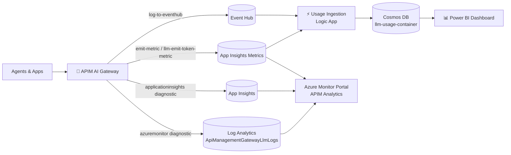
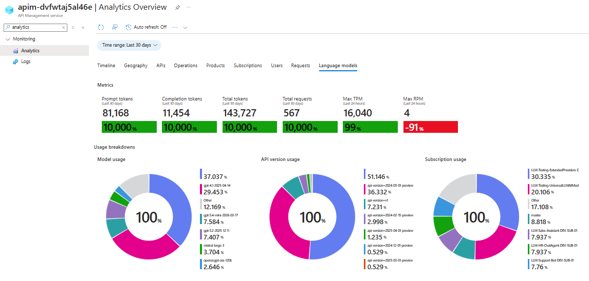
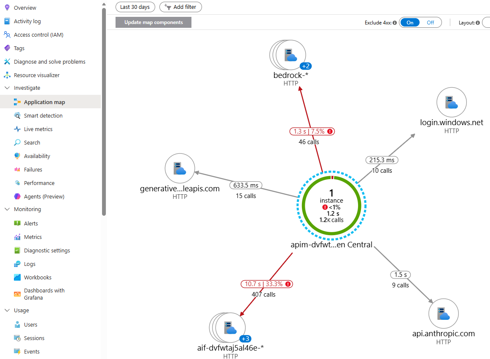
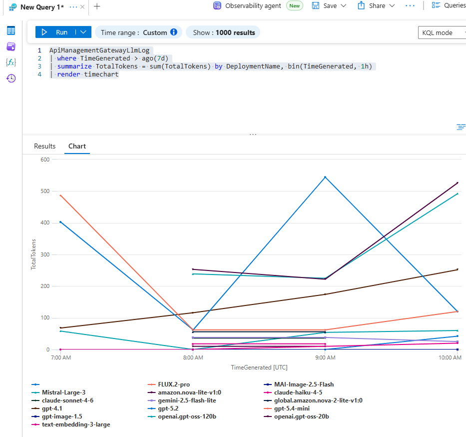

# 📊 Platform Observability Guide

Citadel Governance Hub provides **layered observability** over every AI request that flows through the unified gateway. Because all AI consumption is funneled through Azure API Management (APIM), the hub can observe usage, performance, cost, and — optionally — the full prompt/response content from a **single, central control plane**, without instrumenting individual agents or applications.

This guide describes the four complementary observability capabilities shipped in the accelerator, how each one is configured in the infrastructure-as-code, and where to look for the data.

> 💡 **Reading tip:** Each capability starts with a plain-language **"What it provides"** overview for all readers. The deeper **"⚙️ How it is configured in the accelerator"** sections are **collapsed by default** — click to expand them when you need the infrastructure-as-code detail.

| # | Capability | Primary question it answers | Data store |
|---|------------|-----------------------------|------------|
| 1 | [**APIM Analytics Dashboard**](#1-apim-analytics-dashboard-built-in-llm--ai-usage) | *How much are my LLMs / AI services being used?* | Azure Monitor metrics |
| 2 | [**APIM → Application Insights**](#2-apim--application-insights-performance-monitoring) | *Is the gateway healthy and fast?* | Application Insights |
| 3 | [**APIM → Log Analytics (`ApiManagementGatewayLlmLogs`)**](#3-apim--log-analytics-detailed-llm-logs--optional-prompt-auditing) | *What exactly was sent and returned?* | Log Analytics workspace |
| 4 | [**Cosmos DB usage data + Power BI**](#4-cosmos-db-usage-data--power-bi-finops--chargeback) | *Who is spending what, and how do I charge it back?* | Cosmos DB → Power BI |



---

## 1. APIM Analytics Dashboard (built-in LLM & AI usage)

### What it provides

APIM ships with a native **Analytics** experience in the Azure portal (APIM instance → **Monitoring → Analytics**) plus a dedicated **Language Models** view. Because the gateway emits token-level custom metrics on every request, you get out-of-the-box charts for:

- Requests per API, product (access contract), and operation
- Token consumption (prompt / completion / total) per model and per product
- Latency and response-code distribution

> 

<details>
<summary>⚙️ <strong>How it is configured in the accelerator</strong> — technical details (click to expand)</summary>

The built-in analytics view is powered by the **APIM Azure Monitor diagnostic settings**, not by the usage policies. The accelerator attaches an `azuremonitor` diagnostic to each inference API that is configured to emit the **logs and metrics related to the generative AI gateway** (requests, tokens, models, throttling). This is what surfaces in the portal's **Analytics → Language Models** experience — no additional configuration is required beyond deploying the hub.

The relevant setting is exposed on each API under **Settings → Azure Monitor**, where the **"Log LLM messages"** toggle controls whether prompt/completion message content is captured alongside the metadata. In infrastructure-as-code this maps to the `largeLanguageModel` block of the `azureMonitorLogSettings` parameter applied by the `azuremonitor` diagnostic ([inference-api.bicep](../bicep/infra/modules/apim/inference-api.bicep), [api.bicep](../bicep/infra/modules/apim/api.bicep)):

```bicep
resource apiDiagnostics 'Microsoft.ApiManagement/service/apis/diagnostics@2024-06-01-preview' = {
  name: 'azuremonitor'
  properties: {
    loggerId: apimLoggerId
    // ...
    largeLanguageModel: {
      logs: 'enabled'                                          // emit generative-AI gateway logs & metrics
      requests:  { messages: 'all', maxSizeInBytes: 262144 }   // "Log LLM messages" — prompt content (optional)
      responses: { messages: 'all', maxSizeInBytes: 262144 }   // "Log LLM messages" — completion content (optional)
    }
  }
}
```

> The metadata (token counts, model, deployment, throttling) powers the built-in dashboards regardless of the message toggle. Enabling **"Log LLM messages"** additionally captures prompt/completion content — see [capability 3](#3-apim--log-analytics-detailed-llm-logs--optional-prompt-auditing) for the detailed logs and the data-governance implications of that toggle.

> **Note:** The built-in dashboard shows **aggregated** usage; it does not contain per-request detail or (unless the message toggle is enabled) prompt content. For request-level detail use capability 3, and for cost attribution use capability 4.

> **Related — Application Insights custom metrics.** Separately from the built-in dashboard, the gateway usage policies (`<llm-emit-token-metric>` in [frag-set-llm-usage.xml](../bicep/infra/modules/apim/policies/frag-set-llm-usage.xml), `<azure-openai-emit-token-metric>` in the streaming fragments, and `<emit-metric>` for critical-event alerting in [frag-raise-alert-events.xml](../bicep/infra/modules/apim/policies/frag-raise-alert-events.xml)) ship **custom metrics** to Application Insights. These are described under [capability 2](#2-apim--application-insights-performance-monitoring) and are the recommended target for **alerting** (see the [Throttling & Critical Event Alerting Guide](./throttling-events-handling.md)).

</details>

---

## 2. APIM → Application Insights (performance & usage monitoring)

### What it provides

Every inference API is wired to an **Application Insights** diagnostic channel, giving you application performance monitoring (APM) for the gateway itself:

- End-to-end request tracing with **W3C correlation** across the gateway → backend hop
- Failure and dependency analytics, live metrics, and the *Application Map*
- Response times, failure rates, and configurable request/response **header capture**
- **LLM usage & throttling custom metrics** emitted by the gateway policies — the recommended target for **alerting**
- Optional pre-built Azure portal dashboards

> 

<details>
<summary>⚙️ <strong>How it is configured in the accelerator</strong> — technical details (click to expand)</summary>

**Logger + credential handling.** The accelerator provisions an APIM logger named `appinsights-logger`. Following Microsoft's guidance, the Application Insights connection string is **not** embedded in the logger resource. Instead it is stored as a Key Vault secret and exposed to APIM through a named value resolved with the APIM user-assigned managed identity (auto-refreshed on rotation):

```bicep
// bicep/infra/modules/apim/apim.bicep
var appInsightsConnectionStringSecretName = 'apim-appinsights-connection-string'   // Key Vault secret
var appInsightsLoggerCredentialsNamedValueName = 'appinsights-logger-credentials'  // APIM named value → secret
```

**Per-API diagnostic.** Each inference API attaches an `applicationinsights` diagnostic with verbose logging, client-IP logging, metrics, and 100% fixed sampling ([inference-api.bicep](../bicep/infra/modules/apim/inference-api.bicep), [api.bicep](../bicep/infra/modules/apim/api.bicep)):

```bicep
resource apiDiagnosticsAppInsights 'Microsoft.ApiManagement/service/apis/diagnostics@2022-08-01' = {
  name: 'applicationinsights'
  properties: {
    alwaysLog: 'allErrors'
    httpCorrelationProtocol: 'W3C'
    logClientIp: true
    metrics: true
    verbosity: 'verbose'
    sampling: { samplingType: 'fixed', percentage: 100 }
    // frontend/backend header + body capture from appInsightsLogSettings
  }
}
```

**Header capture** is controlled by the `appInsightsLogSettings` parameter. By default a curated set of correlation and rate-limit headers is captured, with no request body:

```bicep
param appInsightsLogSettings object = {
  headers: [ 'Content-type', 'User-agent', 'x-ms-region',
             'x-ratelimit-remaining-tokens', 'x-ratelimit-remaining-requests' ]
  body: { bytes: 0 }
}
```

**LLM usage & alerting custom metrics.** In addition to request telemetry, the gateway usage policies emit **custom metrics** into this Application Insights component. `<llm-emit-token-metric>` ([frag-set-llm-usage.xml](../bicep/infra/modules/apim/policies/frag-set-llm-usage.xml), namespace `llm-usage`), while `<emit-metric>` in [frag-raise-alert-events.xml](../bicep/infra/modules/apim/policies/frag-raise-alert-events.xml) publishes critical-event alerts — throttling (`429`), backend failures (`5xx`), authorization failures, content-safety blocks, and PII failures (metric `AI Gateway Alert`, namespace `ai-gateway-alerts`, sliced by an `alertType` dimension):

```xml
<llm-emit-token-metric namespace="llm-usage">
    <dimension name="productName"    value="@(context.Product?.Name ?? "Portal-Admin")" />
    <dimension name="deploymentName" value="@((string)context.Variables.GetValueOrDefault<string>("requestedModel","NA"))" />
    <dimension name="appId"          value="@((string)context.Variables.GetValueOrDefault<string>("appId","NA"))" />
    <!-- up to 6 custom dimensions supported -->
</llm-emit-token-metric>
```

Custom metrics require the Application Insights component to have **dimension support** enabled, which the accelerator sets automatically:

```bicep
// bicep/infra/modules/monitor/applicationinsights.bicep
resource applicationInsights 'Microsoft.Insights/components@2020-02-02' = {
  properties: {
    Application_Type: 'web'
    WorkspaceResourceId: logAnalyticsWorkspaceId
    CustomMetricsOptedInType: 'WithDimensions'   // enables custom metric dimensions
  }
}
```

Because these are **App Insights custom metrics**, alerts are easy to set up directly against them (e.g., alert when `throttling-events` exceeds a threshold for a given product or deployment). See the [Throttling Events Handling Guide](./throttling-events-handling.md) for a worked alerting example.

**Connected to Log Analytics.** The Application Insights component is **workspace-based** (`WorkspaceResourceId` points at the hub Log Analytics workspace), so App Insights telemetry and gateway logs live in the same workspace and can be cross-queried with KQL.

**Optional portal dashboards.** Set `createAppInsightsDashboards = true` to deploy the pre-built Azure portal dashboards defined in [applicationinsights-dashboard.bicep](../bicep/infra/modules/monitor/applicationinsights-dashboard.bicep). This is `false` in dev and `true` in the production parameter file ([main.parameters.prod.bicepparam](../bicep/infra/main.parameters.prod.bicepparam)).

</details>

---

## 3. APIM → Log Analytics (detailed LLM logs + optional prompt auditing)

### What it provides

The gateway sends **LLM-aware diagnostics** to Azure Monitor / Log Analytics, surfaced in the dedicated **`ApiManagementGatewayLlmLogs`** table (with correlated entries in `ApiManagementGatewayLogs`). This is the most detailed built-in signal and supports:

- Per-request model, deployment, token usage, and gateway/region metadata
- Full KQL querying, joins, workbooks, and alerting over LLM traffic
- **Optional prompt / completion auditing** — capturing the actual request and response *messages* when compliance or debugging requires it

Example KQL:

```kql
ApiManagementGatewayLlmLog
| where TimeGenerated > ago(7d)
| summarize TotalTokens = sum(TotalTokens) by DeploymentName, bin(TimeGenerated, 1h)
| render timechart
```

> 

<details>
<summary>⚙️ <strong>How it is configured in the accelerator</strong> — technical details (click to expand)</summary>

**Azure Monitor logger.** The gateway attaches an `azuremonitor` diagnostic to each inference API. Its behavior is driven by the `azureMonitorLogSettings` parameter, whose `largeLanguageModel` block controls prompt/completion auditing ([inference-api.bicep](../bicep/infra/modules/apim/inference-api.bicep), [api.bicep](../bicep/infra/modules/apim/api.bicep)):

```bicep
param azureMonitorLogSettings object = {
  frontend: {
    request:  { headers: [], body: { bytes: 0 } }
    response: { headers: [], body: { bytes: 0 } }
  }
  backend: {
    request:  { headers: [], body: { bytes: 0 } }
    response: { headers: [], body: { bytes: 0 } }
  }
  largeLanguageModel: {
    logs: 'enabled'                                          // LLM logging on
    requests:  { messages: 'all', maxSizeInBytes: 262144 }   // audit prompts (≤ 256 KB)
    responses: { messages: 'all', maxSizeInBytes: 262144 }   // audit completions (≤ 256 KB)
  }
}
```

The diagnostic itself uses verbose logging, client-IP logging, and 100% sampling:

```bicep
resource apiDiagnostics 'Microsoft.ApiManagement/service/apis/diagnostics@2024-06-01-preview' = {
  name: 'azuremonitor'
  properties: {
    alwaysLog: 'allErrors'
    verbosity: 'verbose'
    logClientIp: true
    loggerId: apimLoggerId
    sampling: { samplingType: 'fixed', percentage: 100 }
    largeLanguageModel: { /* from azureMonitorLogSettings.largeLanguageModel */ }
  }
}
```

**Controlling prompt/response auditing.** Prompt and completion content capture is a **deliberate, configurable choice**:

| Goal | Setting |
|------|---------|
| Capture full prompts & completions (auditing / debugging) | `largeLanguageModel.requests.messages` = `'all'`, `responses.messages` = `'all'` |
| Log LLM metadata (tokens, model) but **not** message content | `requests.messages` = `'none'`, `responses.messages` = `'none'` |
| Disable LLM logging entirely | `largeLanguageModel.logs` = `'disabled'` |
| Limit payload size | reduce `maxSizeInBytes` (default `262144` = 256 KB) |

> **⚠️ Data governance:** Capturing message content means prompts and completions (which may contain sensitive or personal data) are stored in Log Analytics. Enable it only where your data-handling policy allows, consider pairing it with [PII detection & masking](./pii-masking-apim.md), and apply appropriate workspace retention and access controls.

**Where the workspace comes from.** In the primary deployment the logger targets the hub-provisioned Log Analytics workspace. When using the [APIM Gateway Upgrade](../bicep/infra/apim-gateway-upgrade/README.md) submodule against an existing instance, `deployAzureMonitorLogger` + `logAnalyticsWorkspaceResourceId` wire the `azuremonitor` logger and diagnostic settings to an existing workspace without provisioning a new one.

For the full parameter reference and production examples, see the *Azure Monitor Log Settings* section of the [Full Deployment Guide](./full-deployment-guide.md).

</details>

---

## 4. Cosmos DB usage data + Power BI (FinOps & chargeback)

### What it provides

For long-term, richly structured usage analytics and **cost attribution / chargeback**, the gateway streams a compact usage record per request into Cosmos DB, which is then visualized in **Power BI**. This capability answers the FinOps questions the metrics and logs cannot:

- Cost per **product (access contract)**, model, backend, and application
- Detailed token breakdown (cached, audio, reasoning, prediction) priced independently
- Chargeback/showback of **fixed-cost** capacity (e.g., PTU) via proportional distribution
- Two free-form **custom dimensions** per record (e.g., end-user, session, cost center)

> 

<details>
<summary>⚙️ <strong>How it is configured in the accelerator</strong> — technical details (click to expand)</summary>

**LLM Usage**: ingestion is done through Logic Apps workflow that runs on a schedule (8 times per day by default). The workflow reads the custom metrics in the `llm-usage` namespace from the Application Insights component, transforms them into a compact usage record, and writes them to the Cosmos DB `llm-usage-container`. The workflow is defined in [logic-app-llm-usage-ingestion.bicep](../bicep/infra/modules/logic-apps/logic-app-llm-usage-ingestion.bicep).

**Non-LLM Usage**: It is not activated by default, but it can be activated through referencing `ai-usage` policy fragment in the access contract. This policy relies on `log-to-eventhub` policy to send the usage data to Event Hub, which is then processed by the same Logic App workflow and written to Cosmos DB.

**Published assets (Tools/MCP & Agents/A2A)**: the [Publish Contract](../bicep/infra/citadel-publish-contracts/publish-contract-guide.md#5-usage-tracking) tracks usage the **same way as LLM** — inbound `emit-metric` calls to the `mcp-usage` / `a2a-usage` App Insights namespaces (tool/agent name carried on the `deploymentName` dimension). Two dedicated scheduled Logic App workflows (`mcp-usage-ingestion`, `agent-usage-ingestion`) read those custom metrics and write request-count records into the `mcp-usage-container` / `agent-usage-container` Cosmos collections. **No Event Hub / `log-to-eventhub` is involved** — this keeps MCP streaming intact (MCP policies never read the response body).

**Pricing join & visualization.** A second `model-pricing` container holds per-token-type unit costs; the Power BI report joins usage against pricing to compute cost. The report template, data model, custom-dimension activation, and PTU/fixed-cost handling are documented in detail in the dedicated guide.

> 🔗 **See:** [**Power BI Dashboard Guide**](./power-bi-dashboard.md) for the complete data model, pricing setup, custom dimensions, and step-by-step report configuration.

</details>

---

## Choosing the right signal

| You need… | Use |
|-----------|-----|
| A quick, near real-time view of usage & performance | **APIM Analytics Dashboard** (1) |
| Gateway health, latency, failures, tracing | **Application Insights** (2) |
| Per-request detail and (optionally) the actual prompts/responses | **Log Analytics `ApiManagementGatewayLlmLogs`** (3) |
| Cost attribution, chargeback, and FinOps reporting | **Cosmos DB + Power BI** (4) |

All four capabilities are **complementary** and enabled by default (except prompt-content auditing and the optional portal dashboards, which are opt-in). Together they give platform teams, security/compliance, and FinOps a shared, gateway-centric view of every AI interaction in the enterprise.

---

## Related guides

- [Power BI Dashboard](./power-bi-dashboard.md)
- [Throttling Events Handling](./throttling-events-handling.md)
- [Access Contracts](../bicep/infra/citadel-access-contracts/)
- [Full Deployment Guide](./full-deployment-guide.md) — Azure Monitor & App Insights log settings reference
